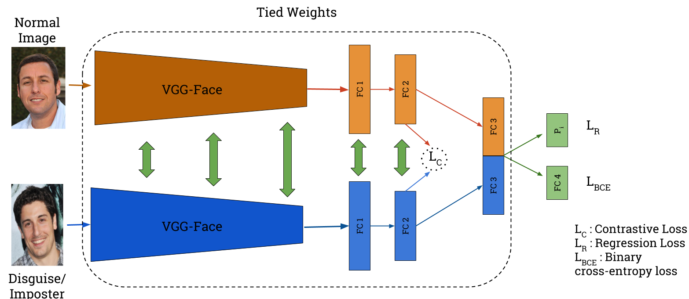

# DisguiseNet : A Contrastive Approach for Disguised Face Verification in the Wild
This is the code for DisguiseNet paper which was accepted at CVPR Disguised Faces in Wild Workshop, 2018.

# Requirements
- [Keras-VGG Face](https://github.com/rcmalli/keras-vggface) : `pip install keras_vggface`
- `Python 2.7` - Currently not compatible with other versions
- Keras with [Tensorflow](https://www.tensorflow.org/install) backend- `pip install keras`

# Architecture


# Citation
```
@inproceedings{peri2018disguisenet,
  title={DisguiseNet: A Contrastive Approach for Disguised Face Verification in the Wild},
  author={Peri, Skand Vishwanath and Dhall, Abhinav},
  booktitle={CVPR Workshop on Disguised Faces in the Wild},
  volume={4},
  year={2018}
}
```
